# Centralized Multi-Repository Setup

Set up Simili Bot with a central control repository that processes issues across your entire organization.

This guide covers **Pattern B** — the centralized multi-repository pattern for organization-wide automation and unified control.

## Overview

In Pattern B:
- One "control" repository contains the master configuration
- The control repository's workflow processes issues across all target repositories
- Issues are routed between repositories automatically
- All repositories use the same Qdrant collection
- Centralized policy enforcement

```mermaid
graph TB
    subgraph control["Control Repository: org/simili-bot-control"]
        config["📄 .github/simili.yaml<br/>Defines all target repos<br/>Defines all rules"]
        workflow["⚙️ Workflow<br/>schedule / webhook"]
    end

    backend["📋 org/backend<br/>Issues monitored<br/>by control repo"]
    frontend["📋 org/frontend<br/>Issues monitored<br/>by control repo"]
    mobile["📋 org/mobile<br/>Issues monitored<br/>by control repo"]
    docs["📋 org/docs<br/>Issues monitored<br/>by control repo"]

    qdrant["🔍 Qdrant<br/>Shared Vector Database<br/>all repos → same collection"]

    config -->|configures| workflow
    workflow -->|monitors| backend
    workflow -->|monitors| frontend
    workflow -->|monitors| mobile
    workflow -->|monitors| docs
    workflow -->|indexes| qdrant

    style control fill:#fff3e0,stroke:#f57c00,stroke-width:3px
    style config fill:#e1f5ff,stroke:#0288d1
    style workflow fill:#fff3e0,stroke:#f57c00
    style backend fill:#e8f5e9,stroke:#388e3c
    style frontend fill:#e8f5e9,stroke:#388e3c
    style mobile fill:#e8f5e9,stroke:#388e3c
    style docs fill:#e8f5e9,stroke:#388e3c
    style qdrant fill:#ffebee,stroke:#c62828
```



## Prerequisites

Before starting, ensure you have:

1. **Multiple GitHub repositories** to manage
2. **Qdrant API Key & URL** from [Qdrant Cloud](https://cloud.qdrant.io)
3. **Gemini API Key** from [Google AI Studio](https://aistudio.google.com/app/apikeys)
4. **GitHub Personal Access Token (PAT)** or **GitHub App** with repository access
   - Required for accessing multiple repositories
   - See [Permission Requirements](/configuration/permissions) for details
5. Admin access to your GitHub organization
6. Access to create a new repository (for the control repo)

## Step 1: Create Control Repository

The control repository is where Simili Bot configuration and workflows live.

### 1a: Create New Repository

1. Go to your GitHub organization
2. Click **New repository**
3. Name it `simili-bot-control` (or your preferred name)
4. Add description: "Simili Bot centralized control and configuration"
5. Make it **Private** (recommended for security)
6. Initialize with a README

### 1b: Clone and Prepare

```bash
git clone https://github.com/your-org/simili-bot-control.git
cd simili-bot-control
```

## Step 2: Create Master Configuration

In the control repository, create the master configuration file that defines all repositories to monitor.

### 2a: Create Config File

Create `.github/simili.yaml`:

```yaml
# Master configuration for organization-wide Simili Bot

qdrant:
  url: "https://your-cluster.qdrant.io:6333"
  api_key: "${QDRANT_API_KEY}"
  collection: "org-issues"  # Shared collection for all repos

embedding:
  provider: "gemini"
  api_key: "${GEMINI_API_KEY}"
  model: "text-embedding-004"
  dimensions: 768

# Global defaults for all repositories
defaults:
  similarity_threshold: 0.70
  max_similar_to_show: 5
  cross_repo_search: true
  duplicate_confidence: 0.85

# List all target repositories this bot will manage
repositories:
  - org: "your-org"
    repo: "backend"
    enabled: true
    description: "REST APIs, database layer, authentication services"
    labels: ["backend", "api"]

  - org: "your-org"
    repo: "frontend"
    enabled: true
    description: "React web UI, responsive design, dashboards"
    labels: ["frontend", "ui"]

  - org: "your-org"
    repo: "mobile"
    enabled: true
    description: "React Native mobile app for iOS and Android"
    labels: ["mobile"]

  - org: "your-org"
    repo: "infrastructure"
    enabled: false  # Temporarily disabled
    description: "Terraform configs, DevOps, infrastructure"
    labels: ["devops"]

  - org: "your-org"
    repo: "docs"
    enabled: true
    description: "User documentation and API guides"
    labels: ["docs"]

# Optional: Issue transfer/routing rules
transfer:
  enabled: true
  llm_routing_enabled: true
  rules:
    # Route documentation issues to docs repo
    - name: "Route to docs"
      priority: 10
      pattern: "documentation|user guide|api docs|how.to"
      target: "your-org/docs"

    # Route infrastructure issues to infrastructure repo
    - name: "Route to infrastructure"
      priority: 20
      pattern: "deployment|terraform|kubernetes|devops|ci/cd"
      target: "your-org/infrastructure"
```

**Important:**
- List **all** repositories that Simili Bot should manage
- Set `enabled: false` to temporarily disable a repo
- Update org/repo names to match your organization

### 2b: Commit Configuration

```bash
git add .github/simili.yaml
git commit -m "Add Simili Bot master configuration"
```

## Step 3: Configure GitHub Authentication

Pattern B requires elevated GitHub permissions to access multiple repositories.

### Option A: Using Personal Access Token (Simpler)

#### Step A1: Create PAT

1. Go to GitHub **Settings** → **Developer settings** → **Personal access tokens** → **Tokens (classic)**
2. Click **Generate new token**
3. Name: `SIMILI_BOT_PAT`
4. **Scopes needed:**
   - ✅ `repo` (Full control of private repositories)
   - ✅ `public_repo` (if managing public repos)
5. Click **Generate token**
6. **Copy the token** (you won't see it again)

#### Step A2: Add to Control Repository Secrets

1. Go to control repo **Settings** → **Secrets and variables** → **Actions**
2. Click **New repository secret**
3. Add secret:
   - Name: `GITHUB_TOKEN_PAT`
   - Value: [paste the PAT from step A1]

### Option B: Using GitHub App (More Secure)

See [Permission Requirements Guide](/configuration/permissions#github-app-setup) for detailed GitHub App setup.

## Step 4: Add Organization Secrets

Add Qdrant and Gemini keys to organization-level secrets for easier management:

1. Go to **Organization Settings** → **Secrets and variables** → **Actions**
2. Click **New organization secret**
3. Add these secrets:

| Secret Name | Value |
|-------------|-------|
| `QDRANT_URL` | `https://your-cluster.qdrant.io:6333` |
| `QDRANT_API_KEY` | Your Qdrant API key |
| `GEMINI_API_KEY` | Your Gemini API key |

4. **Grant access** to `simili-bot-control` repository

## Step 5: Create Workflow - Option A (Scheduled)

The scheduled approach checks for new/updated issues every few minutes.

Create `.github/workflows/simili-bot-scheduled.yml`:

```yaml
name: Simili Bot - Scheduled

on:
  schedule:
    # Run every 5 minutes
    - cron: '*/5 * * * *'
  # Allow manual trigger
  workflow_dispatch:

jobs:
  process-issues:
    runs-on: ubuntu-latest
    permissions:
      issues: write
      contents: read

    steps:
      - uses: actions/checkout@v3

      - uses: similigh/simili-bot@v0.1.0
        with:
          command: "process"
          config_path: ".github/simili.yaml"
          dry_run: false

        env:
          # GitHub token for accessing target repositories
          GITHUB_TOKEN: ${{ secrets.GITHUB_TOKEN_PAT }}

          # Qdrant configuration
          QDRANT_URL: ${{ secrets.QDRANT_URL }}
          QDRANT_API_KEY: ${{ secrets.QDRANT_API_KEY }}

          # Gemini configuration
          GEMINI_API_KEY: ${{ secrets.GEMINI_API_KEY }}
```

**Cron schedule options:**
- `'*/5 * * * *'` — Every 5 minutes
- `'*/10 * * * *'` — Every 10 minutes
- `'0 * * * *'` — Every hour
- `'0 9 * * *'` — Daily at 9 AM UTC

## Step 6: Create Workflow - Option B (Webhook)

The webhook approach processes issues in real-time when they're created.

Create `.github/workflows/simili-bot-webhook.yml`:

```yaml
name: Simili Bot - Webhook

on:
  issues:
    types: [opened, edited]
  pull_requests:
    types: [opened, edited]

jobs:
  process-event:
    runs-on: ubuntu-latest
    permissions:
      issues: write
      pull-requests: write
      contents: read

    steps:
      - uses: actions/checkout@v3

      - uses: similigh/simili-bot@v0.1.0
        with:
          command: "process"
          config_path: ".github/simili.yaml"
          dry_run: false

        env:
          GITHUB_TOKEN: ${{ secrets.GITHUB_TOKEN_PAT }}
          QDRANT_URL: ${{ secrets.QDRANT_URL }}
          QDRANT_API_KEY: ${{ secrets.QDRANT_API_KEY }}
          GEMINI_API_KEY: ${{ secrets.GEMINI_API_KEY }}
```

**Note:** Webhook triggering requires GitHub App with webhook permissions. See [Permission Guide](/configuration/permissions) for setup.

## Step 7: Commit Workflows

```bash
git add .github/workflows/simili-bot-*.yml
git commit -m "Add Simili Bot workflows"
git push
```

## Step 8: Test the Setup

### Test 1: Manual Trigger (if using scheduled workflow)

1. Go to **Actions** tab in control repo
2. Click **Simili Bot - Scheduled**
3. Click **Run workflow** → **Run workflow**
4. Watch the logs

### Test 2: Open Issue in Target Repo

1. Go to one of your target repositories (e.g., `backend`)
2. **Open a new issue**
3. Go back to control repo's **Actions** tab
4. Monitor the workflow execution
5. Go back to the issue — should have Simili Bot comment

### Test 3: Cross-Repository Search

1. **Create test issues** in different repositories
2. In one repo, create an issue with similar text to another repo's issue
3. Simili Bot should find the similar issue from the other repo in its analysis

## Step 9: Verify Configuration

Check that everything is working:

### Verify Qdrant Connection

```bash
# Test from control repo (you can do this locally if you have the token)
curl -X GET "https://your-cluster.qdrant.io:6333/health" \
  -H "api-key: your-qdrant-api-key"
```

### Check Workflow Logs

1. Go to control repo **Actions**
2. Click recent workflow run
3. Expand **process-issues** job
4. Look for:
   - ✅ "Config loaded successfully"
   - ✅ "Processing repository: org/backend"
   - ✅ "Successfully indexed"

### Test Issue Processing

Open an issue in a target repository and verify:
1. ✅ Workflow triggers in control repo
2. ✅ Comment appears on the issue
3. ✅ Analysis shows similar issues across repos

## Scaling Configuration

As your organization grows, organize your configuration:

### By Environment

```yaml
# Production configuration
defaults:
  similarity_threshold: 0.70

repositories:
  - org: "my-org"
    repo: "backend-prod"
    # ... production repos

---

# Staging configuration (separate file)
defaults:
  similarity_threshold: 0.80  # Stricter in staging

repositories:
  - org: "my-org"
    repo: "backend-staging"
    # ... staging repos
```

### By Team

```yaml
# In comments, organize by team
repositories:
  # Backend Team
  - org: "my-org"
    repo: "backend"
    labels: ["team:backend"]

  # Frontend Team
  - org: "my-org"
    repo: "frontend"
    labels: ["team:frontend"]
```

## Performance Considerations

### For 10+ Repositories

The scheduled approach (every 5 minutes) scales well:
- 10 repos × 1-2 issues per 5 min = 2-4 issue checks per cycle
- Average process time: 1-2 seconds per issue
- Total time: ~10-20 seconds per cycle
- Usually completes in time for next cycle

### For 50+ Repositories

Consider:
1. **Increase cron interval:**
   ```yaml
   - cron: '*/10 * * * *'  # Every 10 minutes instead of 5
   ```

2. **Split into multiple workflows:**
   - Workflow A: repos backend, frontend, mobile
   - Workflow B: repos docs, infrastructure, tools
   - Each on staggered schedules

3. **Monitor API rate limits:**
   - Gemini: 60 requests/minute (free tier)
   - Qdrant: Check your plan
   - GitHub: 5,000 requests/hour

## Troubleshooting

### Issue: Workflow fails with "Configuration not found"

**Cause:** Can't find `.github/simili.yaml` in control repo

**Solution:**
1. Verify file exists at exact path: `.github/simili.yaml`
2. Verify file is committed and pushed
3. Check YAML syntax is valid

```bash
# Verify file exists
git ls-files .github/simili.yaml
```

### Issue: "Permission denied" error

**Cause:** PAT doesn't have access to target repositories

**Solution:**
1. Verify PAT has correct scopes:
   - `repo` for private repos
   - `public_repo` for public repos
2. Verify PAT is not expired
3. Verify target repos are accessible with that token
4. If using GitHub App, verify it's installed on target repos

### Issue: Workflow times out

**Cause:** Processing too many repos at once

**Solution:**
1. Increase scheduled interval:
   ```yaml
   - cron: '*/10 * * * *'  # Increase from 5 to 10 minutes
   ```
2. Split configuration into multiple workflows
3. Check if Qdrant/Gemini APIs are responsive

### Issue: Issues not being processed

**Cause:** Multiple possible reasons

**Solutions to try:**
1. Check **Actions** tab for workflow errors
2. Verify repository is listed in config with `enabled: true`
3. Verify YAML syntax is correct
4. Check that GitHub token has sufficient permissions
5. Try running workflow manually: **Actions** → **Run workflow**

### Issue: Comments appear but without analysis

**Cause:** Gemini API not responding

**Solution:**
1. Verify Gemini API key is correct
2. Check API is enabled in Google Cloud Console
3. Check rate limits (free tier: 60 req/min)
4. Try creating issue after a few minutes

## Permissions Reference

What Pattern B can do with elevated token:

| Action | Works |
|--------|-------|
| Read issues across repos | ✅ |
| Post comments across repos | ✅ |
| Create issues in other repos | ✅ |
| Transfer issues across repos | ✅ |
| Close issues in other repos | ✅ |
| Add labels to issues | ✅ |

See [Permissions Guide](/configuration/permissions) for detailed scoping rules.

## Best Practices

### 1. Keep Config in Version Control

Store master config in the control repo:
- ✅ Easy to audit changes
- ✅ Rollback capabilities
- ✅ Review before deployment

### 2. Use Descriptive Repository Names

```yaml
# Good
- org: "my-org"
  repo: "customer-api"
  description: "REST API for customer data"

# Vague
- org: "my-org"
  repo: "service1"
  description: "API service"
```

### 3. Start with Scheduled Workflow

Scheduled is easier to debug than webhook. Once stable, switch to webhook if needed.

### 4. Test Configuration Changes

Before updating master config:
1. Create a test branch
2. Update config
3. Manually trigger workflow
4. Verify behavior
5. Merge if correct

### 5. Document Your Rules

Add comments to config:

```yaml
transfer:
  rules:
    # Route documentation issues to dedicated repo
    # Helps keep doc PRs organized
    - name: "Route to docs"
      priority: 10
      pattern: "documentation|user guide"
      target: "my-org/docs"
```

## Next Steps

Now that you have Pattern B set up:

<CardGroup cols={2}>
  <Card
    title="Permission Requirements"
    href="/configuration/permissions"
    icon="lock"
  >
    Understand advanced permission setup
  </Card>
  <Card
    title="Configuration Reference"
    href="/configuration/overview"
    icon="sliders"
  >
    Learn all configuration options
  </Card>
  <Card
    title="Issue Routing"
    href="/guides/issue-routing"
    icon="share-nodes"
  >
    Setup advanced issue transfers
  </Card>
  <Card
    title="Custom Workflows"
    href="/guides/custom-workflows"
    icon="gear"
  >
    Create advanced automations
  </Card>
</CardGroup>

## Congratulations! 🎉

You've set up Simili Bot with centralized control:
- ✅ Organization-wide issue monitoring
- ✅ Unified configuration and policies
- ✅ Cross-repository search and analysis
- ✅ Automated issue routing
- ✅ Compliance and quality enforcement

Your organization now has intelligent, automated issue management across all repositories!
