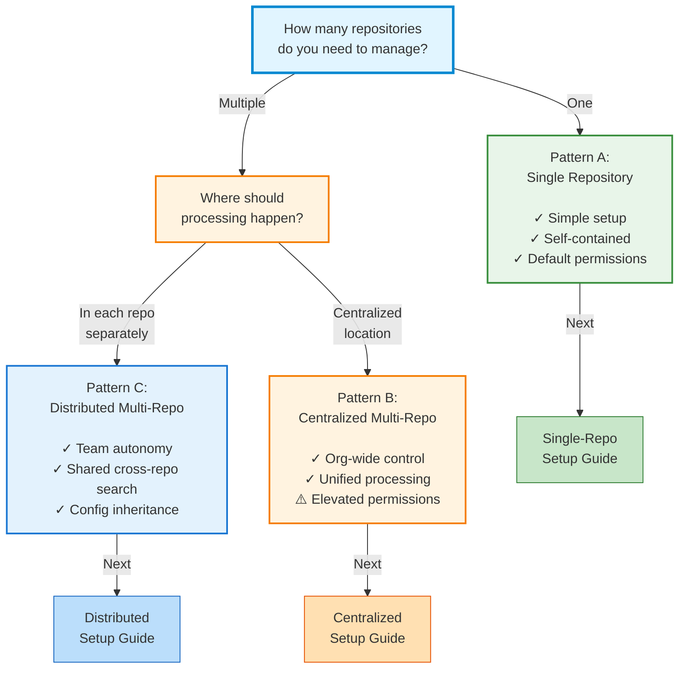

# Choose Your Setup

Simili Bot supports three distinct deployment patterns. Let's find the one that fits your needs.

## Decision Tree



---

## Compare Patterns

````carousel
### Pattern Comparison
| Aspect | Pattern A | Pattern B | Pattern C |
|--------|-----------|-----------|-----------|
| **# of Repos**| 1 | 2+ | 2+ |
| **Permissions**| Default | Elevated | Default |
| **Autonomy** | N/A | Low | High |
| **Complexity** | Simple | Medium | Medium |

<!-- slide -->
### Pattern A: Single Repo
**Best for:** Small projects, single team, focused scope.

- Config lives in the repo.
- Workflow runs in the repo.
- No elevated permissions needed.

[Single Repo Setup Guide](/getting-started/single-repo-setup)

<!-- slide -->
### Pattern B: Centralized
**Best for:** Org-wide bot, compliance, unified control.

- Master config in control repo.
- Processes all repos from one location.
- Requires PAT or GitHub App.

[Centralized Setup Guide](/getting-started/centralized-multi-repo-setup)

<!-- slide -->
### Pattern C: Distributed
**Best for:** Multiple teams, decentralized control.

- Each repo has its own workflow.
- Shared Qdrant instance for knowledge base.
- Config inheritance using `extends`.

[Distributed Setup Guide](/getting-started/distributed-multi-repo-setup)
````

---

## Need More Details?

<CardGroup cols={2}>
  <Card title="Patterns Overview" href="/getting-started/patterns-overview" icon="diagram-project" />
  <Card title="Permission Guide" href="/configuration/permissions" icon="lock" />
</CardGroup>
