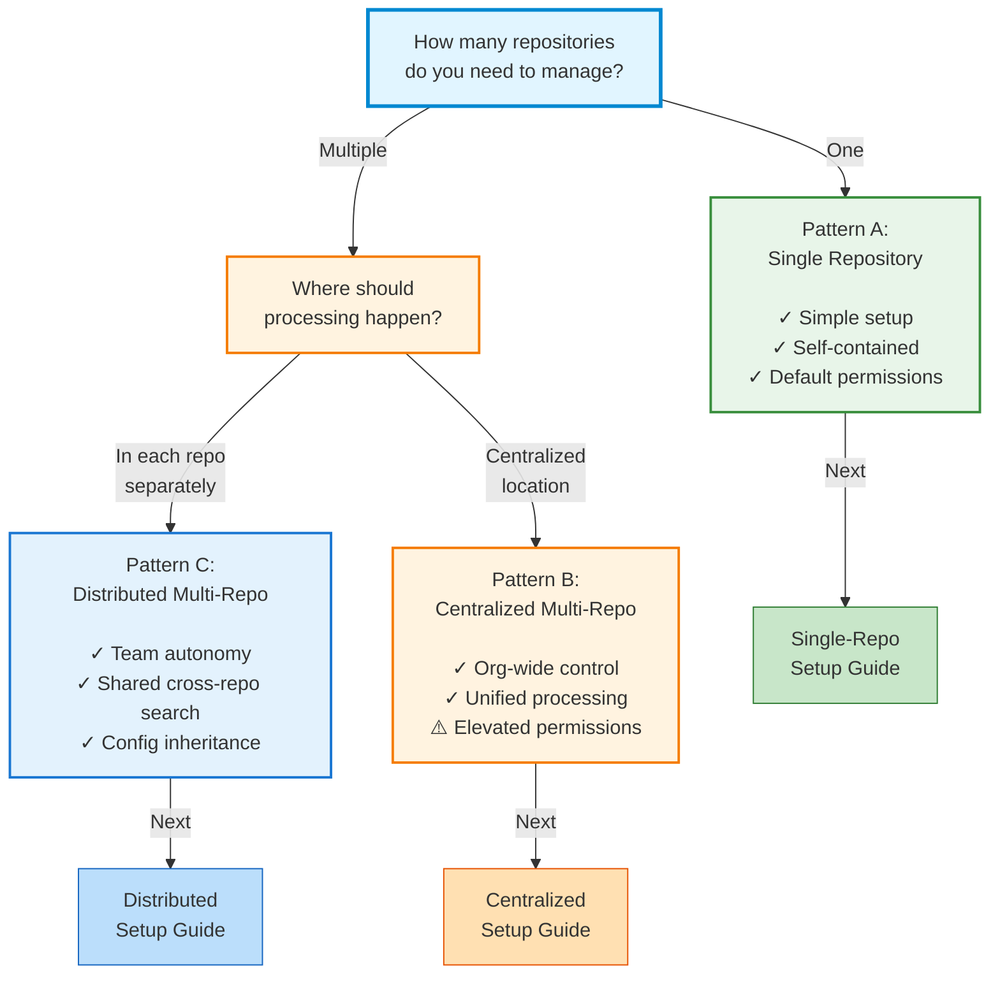

# Choose Your Setup

Simili Bot supports three distinct deployment patterns. Let's find the one that fits your needs.

## Decision Tree



## Quick Comparison

| Aspect | Pattern A | Pattern B | Pattern C |
|--------|-----------|-----------|-----------|
| **# of Repos** | 1 | 2+ | 2+ |
| **Where Config Lives** | Target repo | Control repo | Each repo |
| **Where Workflows Run** | Target repo | Control repo | Each repo |
| **Setup Complexity** | Simple | Medium | Medium |
| **Permissions Needed** | Default | Elevated | Default |
| **Cross-Repo Search** | No | Yes | Yes* |
| **Team Autonomy** | N/A | Low | High |
| **Best For** | Small projects | Org-wide control | Multiple teams |

*Pattern C requires shared Qdrant instance

## Pattern A: Single Repository

**Best for:** Small projects, single team, focused scope

```
your-org/backend
├── .github/
│   ├── simili.yaml          ← Config here
│   └── workflows/
│       └── simili-bot.yml   ← Workflow runs here
├── src/
└── README.md
```

### When to choose:
- Managing one GitHub repository
- Single team or project
- Don't need cross-repo search
- Want simplest possible setup

### Characteristics:
- Config file lives in the repository it processes
- Workflow triggers only on this repository's issues
- No elevated permissions needed
- Uses default `GITHUB_TOKEN`
- Fast to set up (5 minutes)

### Next Step:
<Card
  title="Single Repository Setup"
  href="/getting-started/single-repo-setup"
  icon="rocket"
>
  Step-by-step guide to get running in 5 minutes
</Card>

---

## Pattern B: Centralized Multi-Repository

**Best for:** Organization-wide bot, compliance scanning, unified control

```
your-org/simili-bot-control     ← Control repo
├── .github/
│   ├── simili.yaml             ← Master config
│   └── workflows/
│       └── simili-bot.yml      ← Workflows run here
│
your-org/backend                ← Target repos (don't need config)
your-org/frontend               ← Workflows trigger externally
your-org/mobile                 ← Issues processed by control repo
```

### When to choose:
- Need to process issues across multiple repositories
- Want unified, centralized control
- Prefer one place to manage configuration
- Need to route issues between repositories
- Can set up GitHub App or PAT with elevated permissions

### Characteristics:
- One "control" repository with master configuration
- Lists all target repositories in config
- Workflow in control repo processes all repos (webhook or scheduled)
- Requires elevated GitHub permissions (PAT or GitHub App)
- Takes 10-15 minutes to set up
- Best for enforcing org-wide policies

### Data Flow:
1. Issue created in target repo → Webhook notifies control repo
2. Control repo workflow processes the issue
3. Comments posted back to target repo
4. Issues indexed in shared Qdrant

### Next Step:
<Card
  title="Centralized Multi-Repo Setup"
  href="/getting-started/centralized-multi-repo-setup"
  icon="server"
>
  Complete guide to set up organization-wide processing
</Card>

---

## Pattern C: Distributed Multi-Repository

**Best for:** Multiple teams, decentralized control, cross-repo knowledge

```
your-org/backend                ← Each repo has its own
├── .github/
│   ├── simili.yaml             ← Config (extends base)
│   └── workflows/
│       └── simili-bot.yml      ← Workflow runs here
│
your-org/frontend               ← Each repo independent
├── .github/
│   ├── simili.yaml             ← Extends shared base
│   └── workflows/
│       └── simili-bot.yml
│
your-org/simili-config          ← Shared config repo (optional)
└── base-config.yaml            ← Base config all repos extend
```

### When to choose:
- Multiple repositories, multiple teams
- Each team wants autonomy
- Want shared cross-repo search and knowledge base
- Teams should manage their own configuration
- Prefer decentralized control

### Characteristics:
- Each repository has its own Simili Bot workflow
- Each repository has its own config (can inherit from base)
- Shared Qdrant instance for cross-repo search
- Teams can customize their config while inheriting shared defaults
- Default `GITHUB_TOKEN` works for each repo
- Takes 15-20 minutes to set up (once)
- Best for microservices or multi-team organizations

### Data Flow:
1. Issue created in any repo → Local workflow triggers
2. Local Simili Bot processes the issue
3. Searches shared Qdrant for similar issues across all repos
4. Posts comments with findings
5. All repos index to same Qdrant collection

### Next Step:
<Card
  title="Distributed Multi-Repo Setup"
  href="/getting-started/distributed-multi-repo-setup"
  icon="network"
>
  Complete guide to autonomous team-based deployment
</Card>

---

## Decision Checklist

### Step 1: Answer these questions

- [ ] How many GitHub repositories do you need to manage?
  - One → **Go to Pattern A**
  - Multiple → **Continue to next question**

- [ ] Where should issue processing happen?
  - Each repository independently → **Pattern C (Distributed)**
  - One central location → **Pattern B (Centralized)**

- [ ] Can you set up elevated GitHub permissions?
  - No (using only default tokens) → **Pattern C**
  - Yes (can create GitHub App or PAT) → **Pattern B**

- [ ] Do you need teams to be autonomous?
  - Yes (each team manages their own config) → **Pattern C**
  - No (centralized control is fine) → **Pattern B**

### Step 2: Review your choice

Once you've answered these questions, you should have a clear pattern choice. If still unsure, review the comparison table above.

### Step 3: Follow the setup guide

Each pattern has a dedicated setup guide with complete step-by-step instructions.

---

## Need More Details?

Before diving into setup, you might want to understand the patterns better:

<Card
  title="Patterns Overview"
  href="/getting-started/patterns-overview"
  icon="diagram-project"
>
  Detailed explanation with architecture diagrams
</Card>

<Card
  title="Permission Requirements"
  href="/configuration/permissions"
  icon="lock"
>
  Understand GitHub permissions for each pattern
</Card>

---

## Migration Later

Don't worry about choosing the "perfect" pattern right now. You can always migrate later:

- **Single → Multi-Repo**: Add more repositories and set up shared config
- **Distributed → Centralized**: Move config to central control repo
- **Centralized → Distributed**: Move config to each repo

See [Migration Guides](/guides/migrations/single-to-multi) for step-by-step instructions.
