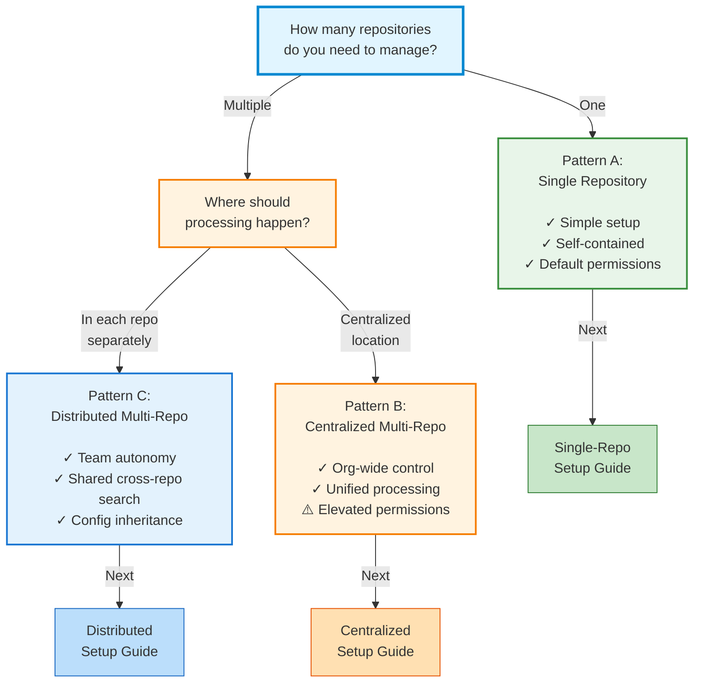

# Choose Your Setup

Simili Bot supports three distinct deployment patterns. Choosing the right one depends on your organization's size, security requirements, and team structure.

## Decision Tree

Use this diagram to quickly identify the best pattern for your current needs.

---

## Pattern Comparison

A detailed look at the trade-offs between the three deployment models.

| Aspect | Pattern A (Single) | Pattern B (Centralized) | Pattern C (Distributed) |
| :--- | :--- | :--- | :--- |
| **Scale** | 1 Repository | 2+ Repositories | 2+ Repositories |
| **Permissions** | Default `GITHUB_TOKEN` | Elevated PAT/App | Default `GITHUB_TOKEN` |
| **Management** | Individual | Unified Control | Autonomous Teams |
| **Complexity** | Very Low | Medium | Medium |
| **Best For** | Standalone Projects | Org-wide Automation | Microservices |

### Pattern A: Single Repo
Best for standalone projects or teams just testing Simili Bot. No special permissions or organization-wide configuration is required.

[Go to Single Repo Setup](/getting-started/single-repo-setup)

### Pattern B: Centralized Multi-Repo
Best for organizations that want unified control over how issues are triaged and routed across all repositories. Everything is managed from one "control" repository.

[Go to Centralized Setup](/getting-started/centralized-multi-repo-setup)

### Pattern C: Distributed Multi-Repo
Best for large organizations with independent teams. Each team manages their own bot, but everyone benefits from a shared cross-repository knowledge base.

[Go to Distributed Setup](/getting-started/distributed-multi-repo-setup)

---

## Need More Details?

<CardGroup cols={2}>
  <Card title="Patterns Overview" href="/getting-started/patterns-overview" icon="diagram-project" />
  <Card title="Permission Guide" href="/configuration/permissions" icon="lock" />
</CardGroup>
