# Distributed Multi-Repository Setup

Set up Simili Bot across multiple repositories with each team managing their own configuration while sharing a unified knowledge base.

This guide covers **Pattern C** — the distributed multi-repository pattern for organizations with multiple teams and repositories.

## Overview

In Pattern C:
- Each repository has its own Simili Bot workflow
- Each repository has its own configuration (optionally extending a shared base)
- All repositories index to the same Qdrant collection
- Cross-repository search is enabled by default
- Teams have autonomy while benefiting from shared knowledge

```mermaid
graph TB
    config["📄 Optional: Shared Base Config<br/>simili-config/base-config.yaml"]

    subgraph backend["Repository: org/backend"]
        config1["📄 .github/simili.yaml<br/>extends: base-config"]
        wf1["⚙️ .github/workflows/simili-bot.yml"]
        issues1["📋 Issues"]
    end

    subgraph frontend["Repository: org/frontend"]
        config2["📄 .github/simili.yaml<br/>extends: base-config"]
        wf2["⚙️ .github/workflows/simili-bot.yml"]
        issues2["📋 Issues"]
    end

    subgraph mobile["Repository: org/mobile"]
        config3["📄 .github/simili.yaml<br/>extends: base-config"]
        wf3["⚙️ .github/workflows/simili-bot.yml"]
        issues3["📋 Issues"]
    end

    qdrant["🔍 Qdrant Vector Database<br/>Shared Collection<br/>All repos index here"]

    config -->|inherited by| config1
    config -->|inherited by| config2
    config -->|inherited by| config3

    config1 -->|configures| wf1
    config2 -->|configures| wf2
    config3 -->|configures| wf3

    wf1 -->|processes| issues1
    wf2 -->|processes| issues2
    wf3 -->|processes| issues3

    wf1 -.->|searches| qdrant
    wf2 -.->|searches| qdrant
    wf3 -.->|searches| qdrant

    style config fill:#e1f5ff,stroke:#0288d1,stroke-width:2px
    style backend fill:#e3f2fd,stroke:#1976d2,stroke-width:2px
    style frontend fill:#f3e5f5,stroke:#7b1fa2,stroke-width:2px
    style mobile fill:#fff3e0,stroke:#f57c00,stroke-width:2px
    style qdrant fill:#ffebee,stroke:#c62828,stroke-width:3px
```



## Prerequisites

Before starting, ensure you have:

1. **Multiple GitHub repositories** to manage
2. **Qdrant API Key & URL** from [Qdrant Cloud](https://cloud.qdrant.io)
3. **Gemini API Key** from [Google AI Studio](https://aistudio.google.com/app/apikeys)
4. **Organization-level GitHub secrets** configured (optional but recommended)
5. Access to create files in each repository

## Step 1: Create Shared Base Configuration (Optional)

This step is optional but recommended for larger setups. It allows teams to inherit common settings while customizing per-repository.

### Option A: Using GitHub Repo for Base Config

1. **Create a shared configuration repository:**
   ```
   your-org/simili-config
   ```

2. **Create the base configuration file:**
   ```
   base-config.yaml
   ```

3. **Add this content:**

```yaml
# your-org/simili-config/base-config.yaml

# Shared Qdrant configuration
qdrant:
  url: "https://your-cluster.qdrant.io:6333"
  api_key: "${QDRANT_API_KEY}"
  collection: "org-issues"  # Shared collection across all repos

# Shared embedding configuration
embedding:
  provider: "gemini"
  api_key: "${GEMINI_API_KEY}"
  model: "text-embedding-004"
  dimensions: 768

# Shared default behaviors
defaults:
  similarity_threshold: 0.70
  max_similar_to_show: 5
  cross_repo_search: true   # Enable cross-repo search
  duplicate_confidence: 0.85

# Optional: Shared transfer rules
transfer:
  enabled: false
  llm_routing_enabled: false
```

4. **Push to GitHub:**
   ```bash
   cd simili-config
   git add base-config.yaml
   git commit -m "Add Simili Bot base configuration"
   git push
   ```

### Option B: Using Direct URL

If you prefer not to create a separate repo, you can host the config file anywhere HTTPS-accessible (e.g., Gist, your documentation site).

## Step 2: Set Up Organization-Level Secrets

This allows all repositories to access the same Qdrant and Gemini API keys without duplicating secrets.

1. Go to **Organization Settings** → **Secrets and variables** → **Actions**
2. Click **New organization secret**
3. Add these secrets:

| Secret Name | Value |
|-------------|-------|
| `ORG_QDRANT_URL` | `https://your-cluster.qdrant.io:6333` |
| `ORG_QDRANT_API_KEY` | Your Qdrant API key |
| `ORG_GEMINI_API_KEY` | Your Gemini API key |

4. **Grant access** to all repositories that will use Simili Bot

### Benefits of Organization Secrets

- ✅ Single source of truth for API keys
- ✅ No duplication across repositories
- ✅ Easier to rotate keys (update once, applies everywhere)
- ✅ More secure (fewer copies of secrets)

## Step 3: Configure First Repository

Let's configure your first repository with Simili Bot.

### 3a: Create Configuration File

In your first repository (e.g., `org/backend`), create `.github/simili.yaml`:

**Option 1: Extending from shared base (recommended)**

```yaml
# backend/.github/simili.yaml
extends: "https://raw.githubusercontent.com/your-org/simili-config/main/base-config.yaml"

# List only this repository
repositories:
  - org: "your-org"
    repo: "backend"
    enabled: true
    description: "REST APIs, database layer, authentication services"

# Optional: Override specific settings for this repo
defaults:
  similarity_threshold: 0.75  # Stricter threshold for backend
  max_similar_to_show: 3
```

**Option 2: Self-contained (if not using shared base)**

```yaml
# backend/.github/simili.yaml
qdrant:
  url: "https://your-cluster.qdrant.io:6333"
  api_key: "${ORG_QDRANT_API_KEY}"
  collection: "org-issues"

embedding:
  provider: "gemini"
  api_key: "${ORG_GEMINI_API_KEY}"
  model: "text-embedding-004"

defaults:
  similarity_threshold: 0.70
  max_similar_to_show: 5
  cross_repo_search: true

repositories:
  - org: "your-org"
    repo: "backend"
    enabled: true
    description: "REST APIs, database layer, authentication services"
```

### 3b: Create GitHub Action Workflow

Create `.github/workflows/simili-bot.yml`:

```yaml
name: Simili Bot

on:
  issues:
    types: [opened, edited]

jobs:
  simili:
    runs-on: ubuntu-latest
    permissions:
      issues: write
      contents: read
    steps:
      - uses: similigh/simili-bot@v0.1.0
        with:
          command: "process"
          config_path: ".github/simili.yaml"
          dry_run: false
        env:
          GITHUB_TOKEN: ${{ secrets.GITHUB_TOKEN }}
          QDRANT_URL: ${{ secrets.ORG_QDRANT_URL }}
          QDRANT_API_KEY: ${{ secrets.ORG_QDRANT_API_KEY }}
          GEMINI_API_KEY: ${{ secrets.ORG_GEMINI_API_KEY }}
```

**Key settings:**
- `GITHUB_TOKEN` — Uses default (works for this repo)
- `ORG_QDRANT_URL` — From organization secrets
- `ORG_QDRANT_API_KEY` — From organization secrets
- `ORG_GEMINI_API_KEY` — From organization secrets

### 3c: Commit and Push

```bash
cd backend
git add .github/simili.yaml .github/workflows/simili-bot.yml
git commit -m "Add Simili Bot (Pattern C distributed)"
git push
```

## Step 4: Test First Repository

1. **Open an issue** in your first repository
2. **Check the Actions tab** to see the workflow run
3. **Verify the comment** appears with Simili Bot analysis

You should see analysis like:
- Similar issues found (from this repo and others)
- Quality assessment
- Suggested labels
- Potential duplicates across all repos

## Step 5: Replicate to Other Repositories

Repeat Step 3 for each additional repository:

### For Frontend Repository

```yaml
# frontend/.github/simili.yaml
extends: "https://raw.githubusercontent.com/your-org/simili-config/main/base-config.yaml"

repositories:
  - org: "your-org"
    repo: "frontend"
    enabled: true
    description: "React web UI, responsive design, user dashboards"
```

### For Mobile Repository

```yaml
# mobile/.github/simili.yaml
extends: "https://raw.githubusercontent.com/your-org/simili-config/main/base-config.yaml"

repositories:
  - org: "your-org"
    repo: "mobile"
    enabled: true
    description: "React Native mobile apps for iOS and Android"
```

### For Infrastructure Repository

```yaml
# infrastructure/.github/simili.yaml
extends: "https://raw.githubusercontent.com/your-org/simili-config/main/base-config.yaml"

repositories:
  - org: "your-org"
    repo: "infrastructure"
    enabled: true
    description: "Terraform configs, DevOps, deployment automation"
```

**Repeat for each repository:**
1. Create `.github/simili.yaml` (update org/repo)
2. Create `.github/workflows/simili-bot.yml` (same workflow)
3. Commit and push
4. Open a test issue

## Step 6: Test Cross-Repository Search

Cross-repository search is what makes Pattern C powerful. Let's test it:

1. **Create test issues** in different repositories:
   - Backend: "Database connection timeout"
   - Frontend: "Network request fails intermittently"
   - Mobile: "API calls timing out"

2. **In one repository**, open a new issue with similar text to the others

3. **Check the Simili Bot comment** — it should find similar issues from **other repositories**

### Expected Output

When creating issue "Connection timeout" in the backend:

```
🤖 Simili Bot Analysis

## Similar Issues Found (Cross-Repository)
- frontend #123: "Network request fails intermittently" (89% similar)
- mobile #45: "API calls timing out" (87% similar)
- backend #12: "Database timeout in prod" (94% similar)

## Cross-Repository Analysis
Multiple teams reporting similar timeout issues. This suggests:
- Infrastructure or network latency issue
- Potential API rate limiting
- Cascading failure pattern
```

This cross-repository insight is invaluable for identifying org-wide problems.

## Step 7: Organize Your Configuration

As your organization grows, consider organizing configurations:

### By Team

```yaml
# backend/.github/simili.yaml
extends: "https://raw.githubusercontent.com/your-org/simili-config/main/base-config.yaml"

defaults:
  # Backend team's specific settings
  similarity_threshold: 0.75

repositories:
  - org: "your-org"
    repo: "backend"
    labels: ["team:backend"]

# frontend/.github/simili.yaml
extends: "https://raw.githubusercontent.com/your-org/simili-config/main/base-config.yaml"

defaults:
  # Frontend team's specific settings
  similarity_threshold: 0.70

repositories:
  - org: "your-org"
    repo: "frontend"
    labels: ["team:frontend"]
```

### By Environment

```yaml
# For staging environment
extends: "https://raw.githubusercontent.com/your-org/simili-config/main/base-staging.yaml"

# For production environment
extends: "https://raw.githubusercontent.com/your-org/simili-config/main/base-production.yaml"
```

## Permissions Matrix

What works by default vs. what needs elevated token:

| Feature | Works with Default Token | Needs Elevated Token |
|---------|--------------------------|----------------------|
| Read own repo issues | ✅ | - |
| Post comments to own repo | ✅ | - |
| Search other repos (read-only) | ✅ | - |
| Transfer issues across repos | ❌ | ✅ |
| Create issues in other repos | ❌ | ✅ |

**For cross-repository issue routing:** If you need to transfer issues from one repo to another, you'll need to set `GITHUB_TOKEN` to a PAT or GitHub App token with elevated permissions.

## Scaling Considerations

### With 10+ Repositories

1. **Create separate base configs** for different environments:
   ```
   base-config.yaml          # Common settings
   base-dev.yaml             # Development
   base-prod.yaml            # Production
   ```

2. **Use team-specific configs**:
   ```
   team-backend.yaml
   team-frontend.yaml
   team-infra.yaml
   ```

3. **Monitor Qdrant collection size**:
   - Estimate: ~1 MB per 10,000 issues
   - For 1M issues: ~100 MB in vector DB

### API Rate Limits

- Gemini API: 60 requests/minute (free tier)
- Qdrant: Depends on plan
- GitHub API: 5,000 requests/hour per token

With 10+ repos, you might approach Gemini API limits. Consider:
- Batching issue processing
- Using higher tier Gemini API
- Implementing request queueing

## Troubleshooting

### Issue: "Configuration not found" error

**Cause:** Can't fetch extended config from GitHub URL

**Solution:**
1. Verify the URL is correct:
   ```bash
   curl https://raw.githubusercontent.com/your-org/simili-config/main/base-config.yaml
   ```
2. Check that file exists and is accessible
3. Verify repository is public or token has access

### Issue: Cross-repo search doesn't work

**Cause:** `cross_repo_search: false` in config

**Solution:**
```yaml
defaults:
  cross_repo_search: true  # Must be enabled
```

### Issue: Different repos have different results

**Cause:** Each repo might have different thresholds

**Solution:**
1. Ensure all repos extend same base config
2. Or explicitly set same thresholds in each:
   ```yaml
   defaults:
     similarity_threshold: 0.70
     max_similar_to_show: 5
   ```

### Issue: "API rate limit exceeded"

**Cause:** Too many issues processed at once

**Solution:**
1. Stagger issue creation
2. Increase Gemini API quota (paid tier)
3. Use higher similarity threshold (fewer searches)

### Issue: Qdrant collection is huge

**Cause:** Storing all org issues indefinitely

**Solution:**
1. Set retention policy in Qdrant
2. Clean up old issues periodically
3. Split into multiple collections by team/project

## Best Practices

### 1. Start Simple

Don't create many base configs initially. Use one shared base:

```yaml
# Step 1: Use this in all repos
extends: "https://raw.githubusercontent.com/your-org/simili-config/main/base-config.yaml"
```

### 2. Evolve Gradually

As needs grow, create specialized bases:

```yaml
# Later: Use specialized base
extends: "https://raw.githubusercontent.com/your-org/simili-config/main/base-backend.yaml"
```

### 3. Document Inheritance

In your base config, document what each setting does:

```yaml
# Cross-repository search: find similar issues across all repos
cross_repo_search: true

# How similar issues must be (0-1 scale)
# 0.70 = pretty similar, 0.85 = very similar
similarity_threshold: 0.70
```

### 4. Test Changes

Before rolling out config changes to all repos:

```yaml
# Create test branch with new config
# Open test issue to verify behavior
# Then merge when confident
```

### 5. Keep Base Config Simple

Put only shared settings in base:

```yaml
# ✅ Good: Core infrastructure settings
qdrant: ...
embedding: ...
defaults:
  cross_repo_search: true

# ❌ Avoid: Repository-specific lists
repositories: ...  # Each repo should define its own
```

## Next Steps

Now that you have Pattern C set up:

<CardGroup cols={2}>
  <Card
    title="Modular Configuration"
    href="/configuration/modular-config"
    icon="sliders"
  >
    Learn advanced config composition
  </Card>
  <Card
    title="Configuration Inheritance"
    href="/guides/config-inheritance"
    icon="network"
  >
    Master config inheritance patterns
  </Card>
  <Card
    title="Permission Guide"
    href="/configuration/permissions"
    icon="lock"
  >
    Understand permission requirements
  </Card>
  <Card
    title="Custom Workflows"
    href="/guides/custom-workflows"
    icon="gear"
  >
    Create advanced automation
  </Card>
</CardGroup>

## Congratulations! 🎉

You've set up Simili Bot across multiple repositories with:
- ✅ Shared knowledge base (Qdrant)
- ✅ Cross-repository issue search
- ✅ Team autonomy and customization
- ✅ Consistent defaults with per-repo overrides

Your teams can now benefit from organization-wide issue intelligence!
