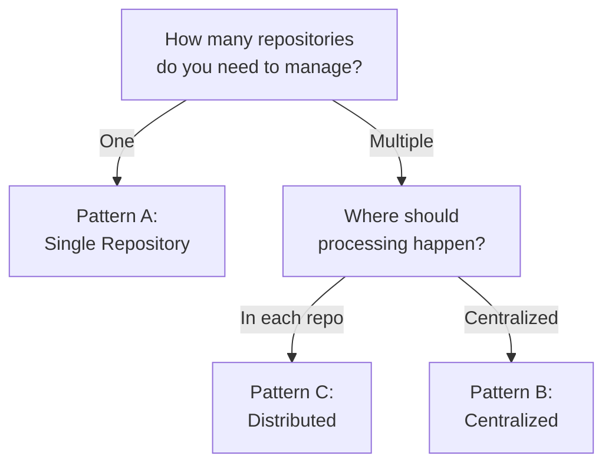

# Deployment Patterns Overview

Simili Bot supports three deployment patterns that address different organizational needs.

## Pattern Comparison

````carousel
| Feature | Pattern A | Pattern B | Pattern C |
|---------|-----------|-----------|-----------|
| **Setup Time** | 5 min | 10-15 min | 15-20 min |
| **Permissions** | Default | Elevated | Default |
| **Best For** | Single Projects | Org-wide control | Team autonomy |
| **Cross-Repo** | No | Yes | Yes |

<!-- slide -->


````

---

## Pattern A: Single Repository

Simple, self-contained setup for managing one repository.

````carousel
### Architecture & Files


**File Structure:**
```
your-repo/
├── .github/
│   ├── simili.yaml
│   └── workflows/
│       └── simili-bot.yml
```

<!-- slide -->
### Configuration Example

```yaml
# .github/simili.yaml
qdrant:
  url: "https://your-cluster.qdrant.io:6333"
  api_key: "${QDRANT_API_KEY}"
  collection: "issues"

defaults:
  cross_repo_search: false

repositories:
  - org: "your-org"
    repo: "your-repo"
    enabled: true
```

<!-- slide -->
### When to Use
| Scenario | ✅ Good Fit |
|----------|-----------|
| Single open-source project | ✅ |
| One repository, one team | ✅ |
| simplest possible setup | ✅ |

**Pros:** No elevated permissions, fast setup, self-contained.
**Cons:** No cross-repo capabilities.
````

---

## Pattern B: Centralized Multi-Repository

Ideal for organizations that want unified control through a single "control repo".

````carousel
### Architecture & Flow


**Flow:**
1. Issue created in target repo
2. Control repo triggered
3. Bot processes and posts analysis to target repo
4. Optional: Router transfers issue

<!-- slide -->
### Master Configuration

```yaml
# In moduli-bot-control repo
qdrant:
  collection: "org-issues"

defaults:
  cross_repo_search: true

repositories:
  - org: "my-org"
    repo: "backend"
  - org: "my-org"
    repo: "frontend"
  - org: "my-org"
    repo: "mobile"
```

<!-- slide -->
### When to Use
| Scenario | ✅ Good Fit |
|----------|-----------|
| Org-wide automation | ✅ |
| Unified compliance | ✅ |
| Cross-repo routing | ✅ |

**Pros:** Unified control, single config point.
**Cons:** Requires PAT/App token, central point of failure.
````

---

## Pattern C: Distributed Multi-Repository

Balance team autonomy with shared organization knowledge.

````carousel
### Architecture & Shared Knowledge


**Flow:**
1. Issue created in any repo
2. Local workflow runs independently
3. Bot searches shared Qdrant collection
4. Shared knowledge across ALL repos

<!-- slide -->
### Repository Config (Inherit)

```yaml
# backend/.github/simili.yaml
extends: "https://raw.githubusercontent.com/my-org/simili-config/main/base-config.yaml"

repositories:
  - org: "my-org"
    repo: "backend"
    description: "REST APIs"
```

**Note:** All repos extend a shared base but manage their own workflows.

<!-- slide -->
### When to Use
| Scenario | ✅ Good Fit |
|----------|-----------|
| Multiple teams | ✅ |
| Team autonomy needed | ✅ |
| Standard permissions | ✅ |

**Pros:** High autonomy, shared search knowledge, default tokens.
**Cons:** More workflow files to manage.
````

---

## Next Steps

<CardGroup cols={3}>
  <Card title="Pattern A Setup" href="/getting-started/single-repo-setup" icon="rocket" />
  <Card title="Pattern B Setup" href="/getting-started/centralized-multi-repo-setup" icon="server" />
  <Card title="Pattern C Setup" href="/getting-started/distributed-multi-repo-setup" icon="network" />
</CardGroup>
