```mermaid
graph TB
    subgraph repo["GitHub Repository: org/backend"]
        config["📄 .github/simili.yaml<br/>repositories: [org/backend]<br/>qdrant config"]
        workflow["⚙️ .github/workflows/simili-bot.yml<br/>on: issues: [opened, edited]"]
        issues["📋 Issues<br/>Processed here"]
    end

    qdrant["🔍 Qdrant<br/>Vector Database<br/>issues collection"]

    workflow -->|processes| issues
    config -->|configures| workflow
    workflow -->|indexes| qdrant

    style repo fill:#f9f9f9,stroke:#333,stroke-width:2px
    style config fill:#e1f5ff,stroke:#0288d1
    style workflow fill:#fff3e0,stroke:#f57c00
    style issues fill:#e8f5e9,stroke:#388e3c
    style qdrant fill:#ffebee,stroke:#c62828
```

```mermaid
graph TB
    subgraph control["Control Repository: org/simili-bot-control"]
        config["📄 .github/simili.yaml<br/>repositories:<br/>- org/backend<br/>- org/frontend<br/>- org/mobile"]
        workflow["⚙️ Workflow<br/>on: schedule / webhook"]
    end

    backend["📋 org/backend<br/>Issues"]
    frontend["📋 org/frontend<br/>Issues"]
    mobile["📋 org/mobile<br/>Issues"]

    qdrant["🔍 Qdrant<br/>Vector Database<br/>shared collection"]

    config -->|configures| workflow
    workflow -->|monitors| backend
    workflow -->|monitors| frontend
    workflow -->|monitors| mobile
    workflow -->|indexes| qdrant

    style control fill:#fff3e0,stroke:#f57c00,stroke-width:3px
    style config fill:#e1f5ff,stroke:#0288d1
    style workflow fill:#fff3e0,stroke:#f57c00
    style backend fill:#e8f5e9,stroke:#388e3c
    style frontend fill:#e8f5e9,stroke:#388e3c
    style mobile fill:#e8f5e9,stroke:#388e3c
    style qdrant fill:#ffebee,stroke:#c62828
```

```mermaid
graph TB
    subgraph backend["Repository: org/backend"]
        config1["📄 simili.yaml<br/>extends: base-config"]
        wf1["⚙️ Workflow<br/>on: issues"]
        issues1["📋 Issues"]
    end

    subgraph frontend["Repository: org/frontend"]
        config2["📄 simili.yaml<br/>extends: base-config"]
        wf2["⚙️ Workflow<br/>on: issues"]
        issues2["📋 Issues"]
    end

    subgraph mobile["Repository: org/mobile"]
        config3["📄 simili.yaml<br/>extends: base-config"]
        wf3["⚙️ Workflow<br/>on: issues"]
        issues3["📋 Issues"]
    end

    qdrant["🔍 Qdrant<br/>Vector Database<br/>shared collection"]

    config1 -->|configures| wf1
    config2 -->|configures| wf2
    config3 -->|configures| wf3

    wf1 -->|processes| issues1
    wf2 -->|processes| issues2
    wf3 -->|processes| issues3

    wf1 -.->|searches| qdrant
    wf2 -.->|searches| qdrant
    wf3 -.->|searches| qdrant

    style backend fill:#e3f2fd,stroke:#1976d2,stroke-width:2px
    style frontend fill:#f3e5f5,stroke:#7b1fa2,stroke-width:2px
    style mobile fill:#fff3e0,stroke:#f57c00,stroke-width:2px
    style qdrant fill:#ffebee,stroke:#c62828,stroke-width:3px
```

# Deployment Patterns Overview

Simili Bot supports three deployment patterns that address different organizational needs. Understanding these patterns helps you choose the right approach for your use case.

---

## Pattern A: Single Repository

Single-repository deployments are the simplest way to get started with Simili Bot.

### Architecture



### How It Works

1. **Issue Created**: Someone opens an issue in your repository
2. **Workflow Triggers**: GitHub Actions detects the `issues` event
3. **Config Loaded**: Simili Bot reads `.github/simili.yaml`
4. **Processing**: Bot analyzes the issue:
   - Finds similar issues (within this repo)
   - Checks for duplicates
   - Assesses quality
   - Suggests labels
5. **Results Indexed**: Issue is indexed in Qdrant
6. **Comment Posted**: Analysis is posted as a GitHub comment

### File Structure

```
your-organization/your-repository/
├── .github/
│   ├── simili.yaml                 # Configuration file
│   └── workflows/
│       └── simili-bot.yml          # GitHub Action workflow
├── src/
├── tests/
└── README.md
```

### Configuration Example

```yaml
# .github/simili.yaml
qdrant:
  url: "https://your-cluster.qdrant.io:6333"
  api_key: "${QDRANT_API_KEY}"
  collection: "issues"

embedding:
  provider: "gemini"
  api_key: "${GEMINI_API_KEY}"
  model: "text-embedding-004"

defaults:
  similarity_threshold: 0.70
  max_similar_to_show: 5
  cross_repo_search: false  # Only search this repo

repositories:
  - org: "your-org"
    repo: "your-repo"      # List only this repository
    enabled: true
```

### Workflow Example

```yaml
name: Simili Bot

on:
  issues:
    types: [opened, edited]

jobs:
  simili:
    runs-on: ubuntu-latest
    permissions:
      issues: write
    steps:
      - uses: similigh/simili-bot@v0.1.0
        env:
          GITHUB_TOKEN: ${{ secrets.GITHUB_TOKEN }}  # Default token works
          QDRANT_URL: ${{ secrets.QDRANT_URL }}
          QDRANT_API_KEY: ${{ secrets.QDRANT_API_KEY }}
          GEMINI_API_KEY: ${{ secrets.GEMINI_API_KEY }}
```

### Permissions

- **GitHub Token**: Uses default `GITHUB_TOKEN` (auto-provided)
- **Scope**: Only needs `issues: write` for this repository
- **Setup**: No additional authentication needed

### When to Use

| Scenario | ✅ Good Fit | ❌ Not Recommended |
|----------|-----------|-------------------|
| Managing a single open-source project | ✅ | |
| One repository, one team | ✅ | |
| Want the simplest setup | ✅ | |
| Want to learn Simili Bot basics | ✅ | |
| Need cross-repo search | | ❌ |
| Multiple repositories to manage | | ❌ |
| Org-wide standardization | | ❌ |

### Pros & Cons

**Pros:**
- ✅ Simplest setup (5 minutes)
- ✅ No elevated permissions needed
- ✅ Self-contained and easy to understand
- ✅ Perfect for learning
- ✅ Can be deployed independently

**Cons:**
- ❌ Can't search across repositories
- ❌ Doesn't scale to multiple repos easily
- ❌ Each repo maintains its own config

### Scaling to Multiple Repos

If you need to manage multiple repositories, you have two migration paths:

1. **To Distributed (Pattern C)**: Add workflow to each repo, share config
2. **To Centralized (Pattern B)**: Create control repo, move config there

See [Single to Multi-Repo Migration](/guides/migrations/single-to-multi) for details.

---

## Pattern B: Centralized Multi-Repository

Centralized deployments are ideal for organizations that want unified control.

### Architecture



### How It Works

1. **Issue Created**: Someone opens an issue in any target repository
2. **Control Repo Triggered**: Via webhook or scheduled check
3. **Config Loaded**: Simili Bot reads `.github/simili.yaml` from control repo
4. **Processing**: Bot processes the issue in the target repo:
   - Finds similar issues (across all configured repos)
   - Checks for duplicates
   - Assesses quality
5. **Comment Posted**: Analysis is posted to the target repo
6. **Routing**: Issue can be transferred to other repos if configured

### File Structure

```
your-organization/simili-bot-control/    # Control repository
├── .github/
│   ├── simili.yaml                      # Master configuration
│   └── workflows/
│       ├── simili-webhook.yml           # Webhook trigger (optional)
│       └── simili-scheduled.yml         # Scheduled trigger
├── README.md
└── docs/
    └── setup.md

your-organization/backend/                # Target repositories
├── src/
└── README.md

your-organization/frontend/
├── src/
└── README.md
```

### Configuration Example

```yaml
# .github/simili.yaml in control repository
qdrant:
  url: "https://your-cluster.qdrant.io:6333"
  api_key: "${QDRANT_API_KEY}"
  collection: "org-issues"  # Shared collection

embedding:
  provider: "gemini"
  api_key: "${GEMINI_API_KEY}"
  model: "text-embedding-004"

defaults:
  similarity_threshold: 0.70
  max_similar_to_show: 5
  cross_repo_search: true   # Search across all repos

# Master configuration lists all target repositories
repositories:
  - org: "my-org"
    repo: "backend"
    enabled: true
    description: "REST APIs and services"

  - org: "my-org"
    repo: "frontend"
    enabled: true
    description: "Web UI and React application"

  - org: "my-org"
    repo: "mobile"
    enabled: true
    description: "Mobile app (React Native)"

# Optional: Issue routing configuration
transfer:
  enabled: true
  llm_routing_enabled: true
  rules:
    - pattern: "documentation.*"
      target: "my-org/docs"
```

### Workflow Options

**Option A: Scheduled (Polling)**

```yaml
name: Simili Bot - Scheduled

on:
  schedule:
    - cron: '*/5 * * * *'  # Every 5 minutes

jobs:
  process:
    runs-on: ubuntu-latest
    steps:
      - uses: actions/checkout@v3
      - uses: similigh/simili-bot@v0.1.0
        with:
          command: "process"
          config_path: ".github/simili.yaml"
        env:
          GITHUB_TOKEN: ${{ secrets.ORG_PAT }}
          # ... other secrets
```

**Option B: Webhook (Real-time)**

Requires GitHub App for receiving webhooks across repositories.

### Permissions

- **Token Type**: Personal Access Token (PAT) or GitHub App token
- **Scope**: Repository access for all target repositories
- **Organization Level**: Can be organization secrets
- **Setup Time**: 10-15 minutes

### GitHub App Setup

If using GitHub App:

1. Create GitHub App in organization settings
2. Grant `issues: read, write` permission
3. Install app to all target repositories
4. Generate and store token in secrets

### When to Use

| Scenario | ✅ Good Fit | ❌ Not Recommended |
|----------|-----------|-------------------|
| Organization-wide automation | ✅ | |
| Unified configuration management | ✅ | |
| Cross-repo issue routing | ✅ | |
| Compliance/security scanning | ✅ | |
| Want centralized control | ✅ | |
| Teams need autonomy | | ❌ |
| Prefer distributed setup | | ❌ |
| Want to minimize permissions | | ❌ |

### Pros & Cons

**Pros:**
- ✅ Unified control point
- ✅ Single configuration for all repos
- ✅ Cross-repo search and routing
- ✅ Easy to enforce organization policies
- ✅ Can implement org-wide compliance

**Cons:**
- ❌ Requires elevated GitHub permissions
- ❌ More complex setup (10-15 minutes)
- ❌ Central point of failure
- ❌ Teams can't override configuration
- ❌ All repos depend on control repo

---

## Pattern C: Distributed Multi-Repository

Distributed deployments balance autonomy with shared knowledge.

### Architecture



### How It Works

1. **Issue Created**: Someone opens an issue in any repository
2. **Local Workflow Triggers**: Each repo's workflow runs independently
3. **Config Loaded**: Local config (extends from base if desired)
4. **Processing**: Bot analyzes the issue:
   - Searches shared Qdrant for similar issues across ALL repos
   - Checks for duplicates
   - Assesses quality
5. **Comment Posted**: Analysis posted to the issue
6. **Indexing**: Issue added to shared Qdrant collection

### File Structure

```
your-organization/simili-config/          # Optional: Shared config repo
└── base-config.yaml                      # Base configuration (v0.1.0)

your-organization/backend/
├── .github/
│   ├── simili.yaml                       # Extends base-config
│   └── workflows/
│       └── simili-bot.yml
├── src/
└── README.md

your-organization/frontend/
├── .github/
│   ├── simili.yaml                       # Extends base-config
│   └── workflows/
│       └── simili-bot.yml
├── src/
└── README.md

your-organization/mobile/
├── .github/
│   ├── simili.yaml                       # Extends base-config
│   └── workflows/
│       └── simili-bot.yml
├── src/
└── README.md
```

### Configuration Example

**Base Configuration** (shared across repos):

```yaml
# simili-config/base-config.yaml
qdrant:
  url: "https://your-cluster.qdrant.io:6333"
  api_key: "${QDRANT_API_KEY}"
  collection: "org-issues"  # All repos use same collection

embedding:
  provider: "gemini"
  api_key: "${GEMINI_API_KEY}"
  model: "text-embedding-004"

defaults:
  similarity_threshold: 0.70
  max_similar_to_show: 5
  cross_repo_search: true   # Search all repos
  duplicate_confidence: 0.85
```

**Repository Config** (backend example):

```yaml
# backend/.github/simili.yaml
extends: "https://raw.githubusercontent.com/my-org/simili-config/main/base-config.yaml"

# Each repo lists only itself but benefits from shared knowledge base
repositories:
  - org: "my-org"
    repo: "backend"
    enabled: true
    description: "REST APIs, database, authentication"

# Optional: repo-specific overrides
defaults:
  similarity_threshold: 0.75  # Stricter than base
  max_similar_to_show: 3
```

**Frontend Config** (similar structure):

```yaml
# frontend/.github/simili.yaml
extends: "https://raw.githubusercontent.com/my-org/simili-config/main/base-config.yaml"

repositories:
  - org: "my-org"
    repo: "frontend"
    enabled: true
    description: "React web UI, responsive design"
```

### Workflow Example

```yaml
name: Simili Bot

on:
  issues:
    types: [opened, edited]

jobs:
  simili:
    runs-on: ubuntu-latest
    permissions:
      issues: write
    steps:
      - uses: similigh/simili-bot@v0.1.0
        with:
          command: "process"
          config_path: ".github/simili.yaml"
        env:
          GITHUB_TOKEN: ${{ secrets.GITHUB_TOKEN }}  # Default works
          QDRANT_URL: ${{ secrets.ORG_QDRANT_URL }}  # Organization secret
          QDRANT_API_KEY: ${{ secrets.ORG_QDRANT_API_KEY }}
          GEMINI_API_KEY: ${{ secrets.ORG_GEMINI_API_KEY }}
```

### Permissions

- **GitHub Token**: Default `GITHUB_TOKEN` (auto-provided)
- **Scope**: Each repo only needs `issues: write` for itself
- **Cross-Repo Search**: Qdrant queries work across all repos
- **Cross-Repo Transfer**: Requires elevated token if enabled
- **Organization Secrets**: Share Qdrant/Gemini keys via org secrets

### When to Use

| Scenario | ✅ Good Fit | ❌ Not Recommended |
|----------|-----------|-------------------|
| Multiple teams, multiple repos | ✅ | |
| Teams need autonomy | ✅ | |
| Want shared cross-repo knowledge | ✅ | |
| Prefer decentralized control | ✅ | |
| Can minimize elevated permissions | ✅ | |
| Need unified global control | | ❌ |
| Prefer single configuration point | | ❌ |
| Want to simplify setup | | ❌ |

### Pros & Cons

**Pros:**
- ✅ Team autonomy and flexibility
- ✅ Shared cross-repo search knowledge base
- ✅ Each team uses default tokens
- ✅ Decentralized control
- ✅ Teams can override per-repo
- ✅ No central point of failure

**Cons:**
- ❌ Slightly more setup (install in each repo)
- ❌ More config files to manage
- ❌ Requires shared Qdrant instance
- ❌ Teams need to coordinate base config changes

---

## Comparison Matrix

### Technical Comparison

| Feature | Pattern A | Pattern B | Pattern C |
|---------|-----------|-----------|-----------|
| **Repositories** | 1 | 2+ | 2+ |
| **Config Locations** | 1 | 1 | N (shared base) |
| **Workflow Locations** | 1 | 1 | N |
| **Qdrant Collection** | Separate | Shared | Shared |
| **Cross-Repo Search** | No | Yes | Yes |
| **Issue Routing** | No | Yes | Yes* |
| **Elevated Permissions** | No | Yes | No |

*With elevated token if needed

### Operational Comparison

| Aspect | Pattern A | Pattern B | Pattern C |
|--------|-----------|-----------|-----------|
| **Setup Time** | 5 min | 10-15 min | 15-20 min (once) |
| **Maintenance** | Minimal | Moderate | Low per-repo |
| **Scaling** | Hard | Easy | Easy |
| **Team Autonomy** | N/A | Low | High |
| **Configuration** | Single | Single | Multiple (inherited) |
| **Permissions** | Standard | Elevated | Standard |
| **Failure Points** | 1 | 1 | N |

### Use Case Fit

| Use Case | Pattern A | Pattern B | Pattern C |
|----------|-----------|-----------|-----------|
| Open-source project | ⭐⭐⭐ | - | - |
| Single team | ⭐⭐⭐ | ⭐ | ⭐⭐ |
| Multiple teams | - | ⭐⭐⭐ | ⭐⭐⭐ |
| Microservices | - | ⭐⭐ | ⭐⭐⭐ |
| Org-wide policy | - | ⭐⭐⭐ | ⭐ |
| Team autonomy | - | ⭐ | ⭐⭐⭐ |
| Shared knowledge | - | ⭐⭐⭐ | ⭐⭐⭐ |

---

## Next Steps

Ready to choose your pattern? Use the [decision tree](/getting-started/choose-your-setup) to find the best fit.

Then follow your pattern's setup guide:

<CardGroup cols={3}>
  <Card
    title="Pattern A Setup"
    href="/getting-started/single-repo-setup"
    icon="rocket"
  >
    Single Repository
  </Card>
  <Card
    title="Pattern B Setup"
    href="/getting-started/centralized-multi-repo-setup"
    icon="server"
  >
    Centralized Multi-Repo
  </Card>
  <Card
    title="Pattern C Setup"
    href="/getting-started/distributed-multi-repo-setup"
    icon="network"
  >
    Distributed Multi-Repo
  </Card>
</CardGroup>
